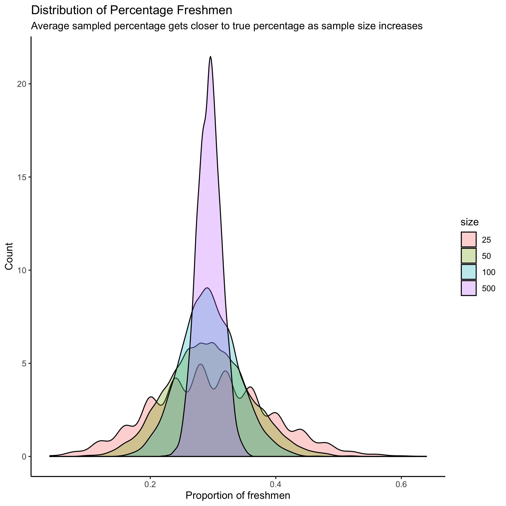

```{r setup, include=FALSE}
knitr::opts_chunk$set(echo = TRUE)
library(haven)
library(tidyverse)
library(janitor)
library(ggplot2)
library(tidycensus)
library(gt)
library(magrittr)
library(infer)

# This chunk loads all the necessary tools and data for the endoresement info.
# This chunk is what we use to call upon functions such as gt and ggplot2. 

```

```{r, include=FALSE}
voter_data <- read_dta("ns20191226/ns20191226.dta")

voter_data

# This loads the data from 12/26/2019 that we use for the madlibs from the 
# folder.

```

# Madlibs

# ML 1)
```{r, ML 1, include = FALSE}
gr_respondents <- voter_data %>%
  count(gun_registry == 1 | gun_registry == 2 | gun_registry == 999, sort = 
          TRUE) %>%
  slice(n=2) %>%
  pull(n)

# I took the voter_data, counted the number of people who were asked about 
# whether the US should create a gun registry, and counted that information to
# get the number of people asked the gun registry question. This madlib 
# required figuring out the codes for the gun registry question from the 
# codebook and counting responses based on that code.

```
Not all respondents were asked every question. `r gr_respondents` respondents were asked the question about whether the USA should create a gun registry.

# ML 2)
```{r, ML 2, include = FALSE}
gun_owners <- voter_data %>%
  filter(gun_registry != "888" & guns_bg != "888" & ban_guns != "888" &
  limit_magazines != "888") %>% 
  count()
  
gun_owners


```

```{r, include = FALSE}
gun_owners_2 <- voter_data %>% 
  filter(gun_registry != "888" & guns_bg != "888" & ban_guns != "888" & 
  limit_magazines != "888") %>% 
  filter(household_gun_owner == "1") %>% 
  count()
  
gun_owners_2
```

```{r, include = FALSE}
gun_owners_perc <- 
  round((gun_owners_2/gun_owners) * 100, digits = 2)

gun_owners_perc
```
Of the respondents that got asked all four gun policy questions, `r gun_owners_perc` percent are gun owners. (For the purposes of this question, you can assume that the people who answered “not sure” are not gun owners). Round to 2 digits after the decimal point.

# ML 3)
```{r, ML 3, include = FALSE}
nh_sgr <- voter_data %>%
  filter(household_gun_owner == 3) %>%
  filter(statements_gun_rights != 888 & statements_gun_rights != 999) %>%
  summarize(mean(statements_gun_rights))
avgnh_sgr <- round(nh_sgr, digits = 2)

# I took the average agreement score for those with no gun owner in the house
# by filtering for definitive responses and averaging those definitive responses
# to two digits.

h_sgr <- voter_data %>%
  filter(household_gun_owner == 1 | household_gun_owner == 2) %>%
  filter(statements_gun_rights != 888 & statements_gun_rights != 999) %>%
  summarize(mean(statements_gun_rights))
avgh_sgr <- round(h_sgr, digits = 2)

# I took the average agreement score for those with a gun owner in the house
# by filtering for definitive responses and averaging those definitive responses
# to two digits. The process of making this code was tough with regard to 
# initially figuring out what to filter, but once I figured that out, 
# replicating the filtering process for the averages of both groups was easy.

avgnh_sgr
avgh_sgr
```
The average “agreement” score (from 1-4) on the statement_gun_rights variable is `r avgnh_sgr` for those respondents who live in households without guns, while the average “agreement” score in households with guns is `r avgh_sgr`.

# ML 4)
```{r, ML 4, include = FALSE}
ya_religion <- voter_data %>%
  select(age, religion) %>%
  filter(age >= "18" & age < "30") %>%
  as_factor(levels = "label") %>%
  group_by(religion) %>%
  count(religion) %>%
  arrange(desc(n)) %>%
  pull(religion) %>%
  head(1)
ya_religion

# With this code, I selected only the necessary information (age & religion)
# and filtered for the 18-30 age range. To make sure that the religion labels
# are used in pulling the top religion, I had to change the factors to look at
# the label specifically. I then counted and arranged the religion in order to
# pull the top religion for adults from 18-30 and get its name for the text 
# below.

adult_religion <- voter_data %>%
  select(age, religion) %>%
  filter(age >= "30") %>%
  as_factor(levels = "label") %>%
  group_by(religion) %>%
  count(religion) %>%
  arrange(desc(n)) %>%
  pull(religion) %>%
  head(1)
adult_religion

# I essentially copied the code from above for this piece too, but I filtered
# for adults 30 and above instead. This code chunk was straightforward as it
# built upon madlibs and past pset concepts.

```
Another set of questions asks about religion. The first ranked category of religion for the age group of people 18-30 is "`r ya_religion`". The first-ranked religion category for people 30 and older is "`r adult_religion`".

# ML 5)
```{r, ML 5, include = FALSE}
ya_none <- voter_data %>%
  select(age, religion) %>%
  filter(age >= "18" | age < "30") %>%
  as_factor(levels = "label") %>%
  group_by(religion) %>%
  count(religion) %>%
  arrange(desc(n)) %>%
  mutate(rank = rank(-n)) %>%
  filter(religion == "Nothing in particular") %>%
  pull(rank)
ya_none

# I copied the code from above but ranked the list according to religion and
# their frequencies. I then filtereed for Nothing in particular amongst the 
# filtered list and pulled the rank to understand where that religion stood for
# young adults. The most difficult part of the code was to figure out how to 
# pull the rank from the religion list. The n element from rank was tough, but
# I figured it out through some collaborative help.

adult_none <- voter_data %>%
  select(age, religion) %>%
  filter(age >= "30") %>%
  mutate(religion = as_factor(religion)) %>% 
  count(religion) %>%
  arrange(desc(n)) %>%
  mutate(rank = rank(-n)) %>%
  filter(religion == "Nothing in particular") %>%
  pull(rank)
adult_none

# I used the same code from above but took at group_by as it is unnecessary 
# with the refactoring of religion.

```
Lots of people say that the younger generation has the highest percent of “nones;” people who answer “nothing in particular”, when you ask them their religion. In the 18-30 age group, “nothing in particular” is ranked `r ya_none`, while in the 30 and above group, “nothing in particular” is ranked `r adult_none`.

# ML 6)
```{r, ML 6, include = FALSE}
ml6 <- voter_data %>%
   as_factor(levels = "label") %>% 
  filter(religion == "Nothing in particular", 
         statements_gun_rights != "Not Asked") %>% 
  group_by(statements_gun_rights) %>% 
  count(statements_gun_rights) %>% 
  arrange(desc(n)) %>% 
  head(1) %>% 
  pull(statements_gun_rights)

ml6

# I refactored the religion data again to filter for Nothing in particular, 
# and I picked the gun rights statements that were not asked. I then arranged 
# the statements in descending fashion to see which ones appeared to be the 
# most popular. This called upon what I did in the milestones above.

```
Consider again the nones (all people who responded “nothing in particular”) when asked about their religion. In this group, the most popular position is to '`r ml6`' (strongly disagree, disagree, agree, or strongly agree?) that it is more important for the government to control who owns guns than it is for the government to protect the right to own guns.


# Question 2A
```{r, Question 2A, include = FALSE}
suit <- c("Diamonds", "Hearts", "Spades", "Clubs")

draw_cards <-function(n) {
  stopifnot(is.numeric(n))
  sample(suit, size = n, replace = TRUE)
}

draw_cards(2)
# I created a function that takes a number of cards to draw and draws them with
# replacement in which one card is replaced by another type.

```
# Question 2B
```{r, Question 2B, include = FALSE}
table <- tibble(draws = map(rep(2,10), draw_cards))


# This tibble takes that function, sets the number of cards drawn to 2, and 
# sets repititions to ten.

```

# Question 2C
```{r, Question 2C, include = FALSE}
new_table <- table %>%
  mutate(First_Card_Red = map_lgl(draws, ~ ifelse(.[[1]] %in% 
                       c("Diamonds", "Hearts"), TRUE, FALSE))) %>%
  mutate(Second_Card_Red = map_lgl(draws, ~ifelse(.[[2]] %in% 
                       c("Diamonds", "Hearts"), TRUE, FALSE)))


# This takes the previous tibble and sets the first card column to True if 
# the first element/card drawn is red (diamonds or hearts). Repeating that, it
# it works for the second card/second element too in the tibble.

```

# Question 2D
```{r, Question 2D, echo = FALSE}
new_table_2 <- new_table %>%
  mutate(Color_Outcome = case_when(First_Card_Red == TRUE & 
                          Second_Card_Red == TRUE ~ "both red",
  First_Card_Red == FALSE & Second_Card_Red == FALSE ~ "both black", 
                                    TRUE ~ "mixed")) %>%
  gt() %>%
  tab_header(title = "Drawing Two Cards", subtitle = "Card Colors") %>%
  cols_label(draws = "Draw", First_Card_Red = "First card red?", Second_Card_Red 
             = "Second card red?", Color_Outcome = "Color Outcome")

new_table_2

# For this tibble, I added a third column which would print an outcome (both 
# red, both black, mixed) based on the sequences of True and False in the 
# previous tibble. This then prints it in a gt table specified by the example.

```

# Question 2E
```{r, Question 2E, include = FALSE}
final_2 <- tibble(draws_2 = map(rep(2, 1000), draw_cards))

final_new_table <- final_2 %>%
  mutate(First_Card_Red = map_lgl(draws_2, ~ ifelse(.[[1]] %in% 
                        c("Diamonds", "Hearts"), TRUE, FALSE))) %>%
  mutate(Second_Card_Red = map_lgl(draws_2, ~ifelse(.[[2]] %in% 
                        c("Diamonds", "Hearts"), TRUE, FALSE)))

mixed <- final_new_table %>%
  mutate(Color_Outcome = case_when(First_Card_Red == TRUE & 
                        Second_Card_Red == TRUE ~ "both red",
  First_Card_Red == FALSE & Second_Card_Red == FALSE ~ "both black", 
  TRUE ~ "mixed")) %>%
  filter(Color_Outcome == "mixed") %>%
  count() / 10

mixed

# This takes the previous tibbles and remakes them but sets reps to 1000 
# instead of 10. However, for the percentage of color outcome, I filtered for
# mixed outcomes and took the percentage of the repitions that were mixed.
# This code just called upon the code done previously in 2.

```
`r mixed` percent of cards have "mixed" colors.

# Question 3
```{r, Question 3, echo = FALSE}
uni <- tibble(grade = c(rep("freshman", 1800),rep("sophomore", 1450), 
        rep("junior", 1570), rep("senior", 1300)), student_id = c(1:6120))

# Created a tibble with the specified numbers per grade. Also made a student_id
# element for all 6120 students in the university.

uni %>%
  count(grade = factor(grade)) %>%
  mutate(pct = prop.table(n)) %>%
  ggplot(aes(x = grade, y = pct, label = scales::percent(pct))) +
  geom_col(position = 'dodge') +
  geom_text(position = position_dodge(width = .9), vjust = -0.5, size = 3) +
  scale_y_continuous(labels = scales::percent) +
  theme_classic() +
  ylab("pct") +
  labs(title = "University Composition by Grade", subtitle = 
         "Entire Study Population")

# This code was tough as I wasn't sure how to factor grade and mutate pct, but
# after talking to others, I figured out how to use count and mutate in this 
# graph. With the actual plot itself, it was difficult figuring out how to use
# geom_text to put the proportions on the bars as it wasn't something I had
# done before and took a bit of trial-and-error.

```


# Question 4
```{r, Question 4, echo = FALSE}
set.seed(02139)

sampled <- uni %>%
  rep_sample_n(size = 25, reps = 5000)


percent_freshmen <- sampled %>%
  group_by(replicate) %>%
  summarize(freshman = sum(grade == "freshman")) %>%
  mutate(proportion_freshmen = freshman / 25)

x <- percent_freshmen %>%
  ggplot(aes(x = proportion_freshmen)) +
  geom_histogram(binwidth = 0.05, boundary = 0.4, color = "white") +
  labs(x = "Percentage of Freshmen per 25 students", 
       title = "Distribution of Percentage Of Freshmen For 5000 Samples")

x

# I used set.seed from the question 4 rubric and then created a sample based on
# the tibble from question 3. I then summarized the tibble and manipulated the
# data to get the proportion of students who were freshmen in every sample of
# 25 university students. Afterward, creating a ggplot was simple as i just took
# the proportion for the different reps to make a bar graph of freshmen/25 students.

```

# Question 5
```{r, Question 5, echo = FALSE}
sizes <- set_names(list(25, 50, 100, 500), nm = list(25, 50, 100, 500))

set.seed(02139)

uni_sample <- map_df(sizes, ~ rep_sample_n(uni, size =., reps = 5000), 
                     .id = "sizes") %>%
  group_by(sizes, replicate)

frosh_sample <- uni_sample %>% 
  summarize(freshman = sum(grade == "freshman"), total = n()) %>%
  mutate(prop_frosh = freshman / total)

frosh_sample$sizes = factor(frosh_sample$sizes, 
                            levels = c("25", "50", "100", "500"))

y <- frosh_sample %>%
  ggplot(aes(x = prop_frosh, show.legend = TRUE, fill = sizes)) +
geom_density(alpha=.3) +
theme_classic() +
labs(x = "Proportion of freshmen", y = "Count", title =
  "Distribution of Percentage Freshmen", subtitle = 
  "Average sampled percentage gets closer to true percentage as sample size increases",
  fill = "size")

y

# I created a list of four different sizes to allow for me to get the samples
# of all different sizes and represent the proportion of freshmen in those 
# sizes. I called set.seed to have the distribution values be the same for me
# as they were on the problem set guide. I then sampled from my university 
# tibble using the instructions from the pset guide. To get the percentage of 
# freshmen from that data, I counted the incidence of freshman and divided it
# by the total number of students. The next part was tough for me. I did not 
# realize that we had to refactor the data for the sizes , so they could be
# entered in the ggplot. However, having joined Yao's study hall and hearing 
# him advise another student on this, I was able to figure it out. Lastly, 
# using the percentage of freshmen, I created a density plot by looking up how 
# to on Cookbook for R.com. This was the toughest problem as I was stuck on 
# figuring out how to factor the data into the graph and only learned to do it
# after consultation with others. 

```

# Question 6
```{r, Question 6, echo = FALSE}


# I published this in ps_5_rpub.Rmd onto the rpubs website and saved it on my
# computer using the instructions from the pset guide.

```
https://rpubs.com/hamaadwmehal/ps_5_graph

# Question 7

https://github.com/GOV-1005-Spring-2020/problem-set-5-hamaadwmehal/issues/1

# Question 8

I would prefer to sample 1000 people in each of the five major cities. This is 
my preference because, in a large, diverse country, we need to account for the
diversity of the country which is generally more evident in urban areas than in
states (as states have demographic inequities). Thus, I decided the most 
accurate estimate of the *population* and the *population parameter* would be 
derived from *sampling* an urban population, especially as the samples from the
urban areas are also larger. Obviously, we cannot perform a *census* on the 
entire population as that is too expensive, exhaustive, and there's not enough 
time. I believe the best *point estimates* that we will be able to label as 
being a *representative sample* will be from the urban samples as they are 
larger and will likely account for the diversity of the country better. Also, 
because the election is based on the popular vote, a larger sample from an 
urban, diverse population will allow the campaign to best understand where it
stands in the polls. Because of this, I believe urban polling provides the most
*generalizability*, and although *biased sampling* will occur as urban polling
overrepresents diversity and urban-specific demographics, urban polling also 
provides the most *random sampling* in understanding the diversity in a country
with elections based on a popular vote election.

Collaborators: Tahmid Ahmed, Ibraheem Khan, Hamid Khan, Naina Tejani, 
Jun Yong Kim, Asmer Safi